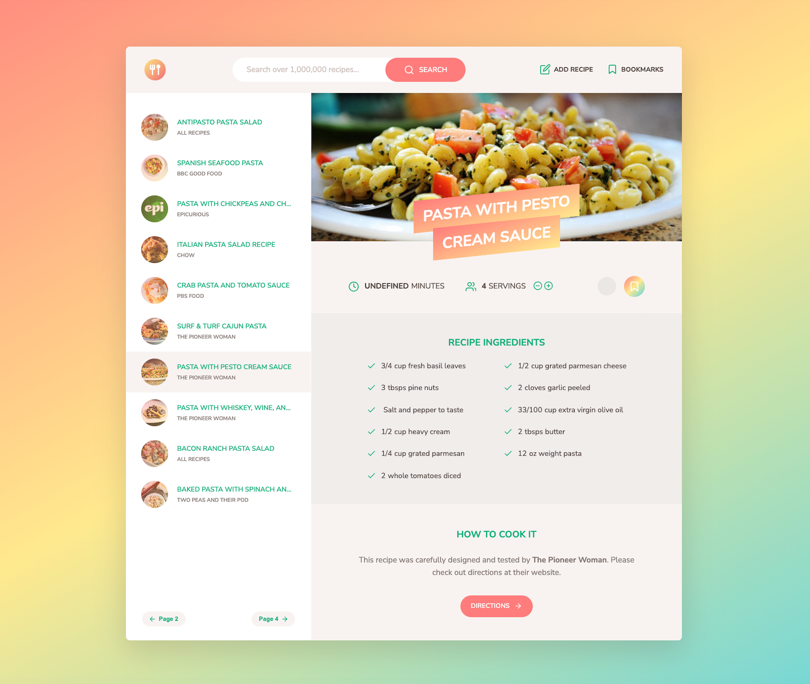

# Culinary world
Welcome to the Culinary world, your personalized navigation system for culinary adventures!

## Table of Content
* [Overview](#Overview)
* [The Story](#The-Story)
* [Built With](#Built-With)
* [Contributing](#Contributing)
* [Author](#Author)
* [License](#License)
  
## Overview
Recipe Central is a web application designed to empower home cooks and food enthusiasts to:

- Discover delightful recipes: Explore a diverse collection of recipes, categorized and searchable by ingredients, cuisine, dietary needs, and more.
- Manage personal recipes: Effortlessly create, edit, and organize your own recipe collection.
- Share culinary creations: Share your favorite recipes with friends and family, spreading the joy of cooking.
- Plan meals with ease: Create weekly meal plans to streamline your cooking routine.
- Generate grocery lists: Effortlessly create shopping lists based on selected recipes, saving time and ensuring you have all the necessary ingredients on hand.

## The Story
Oh the inspiration!

Remember staring blankly at your fridge, longing for a delicious but doable meal? Culinary World was born from that very frustration. I wanted a space where anyone, from kitchen novices to seasoned chefs, could easily discover, manage, and share recipes that fit their tastes and dietary needs.

## Built With
- Python - The Backend Language
- Flask - The Web Development Framework
- API - Application Programming Interface
- Javascript - The Frontend Language
- HTML  - The Frontend Language
- css - The Frontend Language
- Sass - The Frontend Language

 
## Contributing
We welcome contributions! Please follow these steps:

  1. Fork the repository.
  2. Create a new branch for your changes.
  3. Make your changes and commit them with clear messages.
  4. Push your branch to your fork.
  5. Create a pull request.

## Author
Niama SKAY - [Github](https://github.com/Niamask) / [Twitter](https://twitter.com/NiamaSky)

## License
Public Domain. No copy write protection. 

## Bon Appétit!
